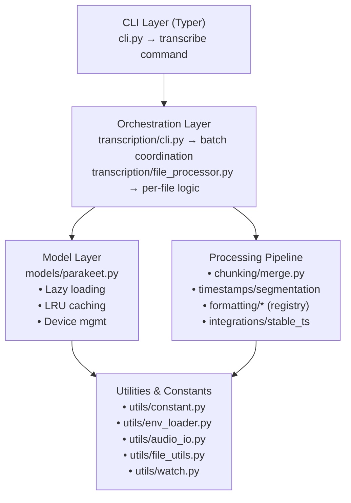
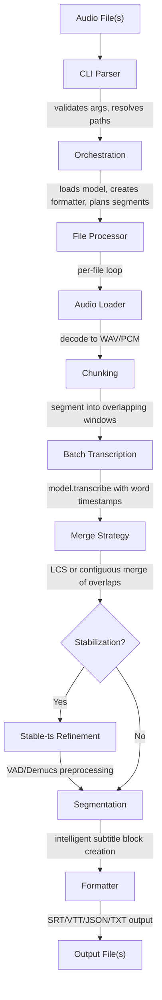

<!-- SECTIONS:ARCHITECTURE,DESIGN_PATTERNS,CLI,DOCKER,TESTS -->

# Project Overview – parakeet-rocm [](./VERSIONS.md)

This repository provides a containerised, GPU-accelerated Automatic Speech Recognition (ASR) inference service for the NVIDIA **Parakeet-TDT 0.6B v2** model, running on **AMD ROCm** GPUs.

---

## Table of Contents

- [Architecture Overview](#architecture-overview)
- [Design Patterns & Principles](#design-patterns--principles)
- [Directory layout](#directory-layout)
- [Audio / video format support](#audio--video-format-support)
- [Configuration & environment variables](#configuration--environment-variables)
- [Key technology choices](#key-technology-choices)
- [Build & run (quick)](#build--run-quick)
- [CLI Features](#cli-features)
- [SRT Diff Report & Scoring](#srt-diff-report--scoring)

---

## Architecture Overview

The codebase follows a **layered, modular architecture** with clear separation of concerns:

### High-Level Architecture



### Key Architectural Principles

1. **Separation of Concerns**: CLI parsing, orchestration, model management, and processing are isolated into distinct modules.
2. **Dependency Injection**: Models and formatters are passed as protocol-typed dependencies rather than hard-coded imports.
3. **Lazy Loading**: Heavy dependencies (NeMo, stable-ts) are imported only when needed via dynamic imports.
4. **Single Responsibility**: Each module has a focused purpose (e.g., `merge.py` only handles chunk merging).
5. **Configuration Centralization**: All environment variables are loaded once in `utils/constant.py` and exposed as typed constants.

### Data Flow



---

## Design Patterns & Principles

### 1. **Protocol-Oriented Design**

**Location**: `transcription/file_processor.py`

Defines `SupportsTranscribe` and `Formatter` protocols to decouple the transcription pipeline from concrete NeMo model types:

```python
class SupportsTranscribe(Protocol):
    def transcribe(self, *, audio, batch_size, return_hypotheses, verbose) -> Sequence[Any]: ...

class Formatter(Protocol):
    def __call__(self, aligned: AlignedResult, *, highlight_words: bool = ...) -> str: ...
```

**Benefits**:

- Enables testing with mock models without GPU dependencies
- Allows swapping ASR backends without changing pipeline code
- Type-safe duck typing with static analysis support

### 2. **Registry Pattern**

**Location**: `formatting/__init__.py`

A dictionary-based registry maps format names to formatter functions:

```python
FORMATTERS: Dict[str, Callable[[AlignedResult], str]] = {
    "txt": to_txt,
    "json": to_json,
    "srt": to_srt,
    "vtt": to_vtt,
    # ...
}

def get_formatter(format_name: str) -> Callable:
    return FORMATTERS[format_name.lower()]
```

**Benefits**:

- Easy extension: add new formats by implementing a function and registering it
- Runtime format selection without conditional logic
- Single source of truth for supported formats

### 3. **Singleton Configuration (Environment Variables)**

**Location**: `utils/env_loader.py`, `utils/constant.py`

Environment variables are loaded **exactly once** at module import time using `@lru_cache(maxsize=1)`:

```python
# env_loader.py
@functools.lru_cache(maxsize=1)
def load_project_env(force: bool = False) -> None:
    # Load .env file once

# constant.py
load_project_env()  # Called at import time
DEFAULT_CHUNK_LEN_SEC: Final[int] = int(os.getenv("CHUNK_LEN_SEC", "300"))
```

**Benefits**:

- Prevents accidental re-reads or inconsistent state
- Centralized configuration access via typed constants
- Enforces the "single loading point" policy (see AGENTS.md §3)

### 4. **Lazy Model Loading with LRU Cache**

**Location**: `models/parakeet.py`

The model is loaded on-demand and cached with `@lru_cache(maxsize=4)` to support multiple model variants:

```python
@lru_cache(maxsize=4)
def _get_cached_model(model_name: str) -> ASRModel:
    return _load_model(model_name)

def get_model(model_name: str) -> ASRModel:
    model = _get_cached_model(model_name)
    _ensure_device(model)  # Promote to GPU if available
    return model
```

**Benefits**:

- Defers expensive model loading until first transcription
- Supports model hot-swapping without restarting the service
- Enables idle unload to CPU for VRAM management (watch mode)

### 5. **Strategy Pattern (Merge Strategies)**

**Location**: `chunking/merge.py`

Two merge strategies are provided as pure functions:

- `merge_longest_contiguous`: Fast midpoint-based merge
- `merge_longest_common_subsequence`: Text-aware LCS merge

Selected at runtime via CLI flag `--merge-strategy`:

```python
if merge_strategy == "contiguous":
    merged_words = merge_longest_contiguous(a, b, overlap_duration=overlap)
else:
    merged_words = merge_longest_common_subsequence(a, b, overlap_duration=overlap)
```

**Benefits**:

- Pluggable algorithms without modifying caller code
- Easy A/B testing and benchmarking
- Backend-agnostic (operates on `Word` models, not NeMo internals)

### 6. **Adapter Pattern**

**Location**: `timestamps/adapt.py` (inferred from usage in `file_processor.py`)

Adapts NeMo-specific hypothesis objects to the project's canonical `AlignedResult` / `Word` models:

```python
aligned_result = adapt_nemo_hypotheses(hypotheses, model, time_stride)
```

**Benefits**:

- Isolates NeMo API changes to a single adapter module
- Downstream code (segmentation, formatting) works with stable domain models
- Enables future support for non-NeMo ASR backends

### 7. **Observer Pattern (Watch Mode)**

**Location**: `utils/watch.py`

The watcher polls directories for new files and triggers a callback:

```python
def watch_and_transcribe(
    patterns: list[str],
    transcribe_fn: Callable[[list[Path]], None],
    ...
) -> None:
    while True:
        new_files = _discover_new_files(patterns, seen_files)
        if new_files:
            transcribe_fn(new_files)
        time.sleep(poll_interval)
```

**Benefits**:

- Decouples file discovery from transcription logic
- Supports idle model unloading after inactivity timeout
- Graceful shutdown via signal handlers

### 8. **Immutable Data Models (Pydantic)**

**Location**: `timestamps/models.py`

All domain models are Pydantic `BaseModel` subclasses:

```python
class Word(BaseModel):
    word: str
    start: float
    end: float
    score: float | None = None

class Segment(BaseModel):
    text: str
    words: list[Word]
    start: float
    end: float
```

**Benefits**:

- Automatic validation and type coercion
- Serialization to JSON for API/logging
- Immutability by default (prevents accidental mutation)

### 9. **Dependency Inversion Principle**

High-level modules (CLI, orchestration) depend on abstractions (protocols, formatters) rather than concrete implementations:

- CLI imports `get_formatter()` (factory) not specific formatters
- File processor accepts `SupportsTranscribe` protocol, not `ASRModel`
- Merge functions operate on `Word` models, not NeMo tokens

**Benefits**:

- Testability: mock implementations satisfy protocols
- Flexibility: swap implementations without changing high-level code
- Reduced coupling between layers

### 10. **Command Pattern (CLI Structure)**

**Location**: `cli.py`

Typer commands encapsulate requests as objects with all parameters:

```python
@app.command()
def transcribe(
    audio_files: list[str] | None,
    model_name: str,
    output_dir: Path,
    # ... 20+ parameters
) -> list[Path] | None:
    # Delegate to implementation
    return _impl(...)
```

**Benefits**:

- Declarative argument definitions with type hints
- Automatic help generation and validation
- Easy to add new commands or options

---

## Directory layout

```txt
parakeet_rocm/
├── Dockerfile                  # Build image with ROCm, NeMo 2.2, project code
├── docker-compose.yaml         # Orchestrate container with /opt/rocm bind-mounts
├── pyproject.toml              # Exact, pinned Python dependencies (PDM-managed)
├── README.md                   # Quick-start & usage
├── .env.example                # Example environment variables
├── .gitignore                  # Common ignores
├── .dockerignore               # Ignore build context cruft
│
├── .github/                    # GitHub Actions and PR templates
│   └── ...
│
├── parakeet_rocm/     # Python package
│   ├── __init__.py
│   ├── cli.py                  # Typer-based CLI entry point with rich progress
│   ├── transcribe.py           # Thin wrapper re-exporting transcription CLI
│   ├── transcription/          # Modular transcription pipeline
│   │   ├── __init__.py
│   │   ├── cli.py              # Orchestrates batch transcription
│   │   ├── file_processor.py   # Per-file transcription logic
│   │   └── utils.py            # Environment and stride helpers
│   ├── chunking/
│   │   ├── __init__.py
│   │   └── merge.py            # Overlap-aware merging of transcribed segments
│   ├── timestamps/
│   │   ├── __init__.py
│   │   ├── segmentation.py     # Intelligent subtitle segmentation
│   │   └── models.py           # Data models for aligned results
│   ├── formatting/
│   │   ├── __init__.py
│   │   ├── _srt.py             # SRT formatting logic
│   │   ├── _txt.py             # TXT formatting logic
│   │   └── ...                 # Other formatters (VTT, JSON)
│   ├── utils/
│   │   ├── __init__.py
│   │   ├── audio_io.py         # WAV/PCM helpers
│   │   ├── file_utils.py       # File naming and overwrite protection
│   │   ├── watch.py            # File/directory watching logic
│   │   ├── constant.py         # Environment variables and constants
│   │   └── env_loader.py       # Environment configuration loader
│   └── models/
│       ├── __init__.py
│       └── parakeet.py         # Model wrapper (load & cache)
│
├── scripts/
│   ├── export_requirements.sh  # PDM -> requirements-all.txt
│   └── dev_shell.sh            # Helper to exec into running container
│
├── data/
│   ├── samples/sample.wav      # Example audio
│   └── output/                 # Transcription outputs
│
└── tests/
    ├── __init__.py
    ├── test_transcribe.py
    ├── test_merge.py
    ├── test_segmentation_and_formatters.py
    └── test_file_utils.py      # Tests for file utilities
```

### Helper Script: transcribe_three.sh

A convenience wrapper to run three common transcription variants for a single input file:

```bash
bash scripts/transcribe_three.sh <audio_file>
```

This will generate SRT outputs in:

- `data/output/default/`
- `data/output/stabilize/` (with `--stabilize`)
- `data/output/stabilize_vad_demucs/` (with `--stabilize --vad --demucs`)

Notes:

- The script prefers `pdm run parakeet-rocm` when PDM is installed; otherwise it calls `parakeet-rocm` directly.
- Word timestamps and SRT output are enabled for all three runs.

### Unified Helper: transcribe_and_diff.sh

Run three transcription variants and then compare all pairwise SRT diffs, or run either step alone.

```bash
# Both steps (default): transcribe 3 variants then produce Markdown+JSON diffs
bash scripts/transcribe_and_diff.sh <audio_file>

# Transcribe only
bash scripts/transcribe_and_diff.sh --transcribe <audio_file>

# Report only (requires SRTs present)
bash scripts/transcribe_and_diff.sh --report <audio_file>

# Include top-N violations in reports and choose output directory
bash scripts/transcribe_and_diff.sh --report --show-violations 5 --out-dir data/test_results/ <audio_file>
```

### Outputs

- Transcriptions written to:
  - `data/output/default/`
  - `data/output/stabilize/`
  - `data/output/stabilize_vad_demucs/`
- Diff reports (Markdown and JSON) written to `data/test_results/` by default, with filenames like:
  - `srt_diff_default_vs_stabilize_<stem>.{md,json}`
  - `srt_diff_default_vs_stabilize_vad_demucs_<stem>.{md,json}`
  - `srt_diff_stabilize_vs_stabilize_vad_demucs_<stem>.{md,json}`

### Notes

- Uses `pdm run` where available. For diffing it calls `python -m scripts.srt_diff_report`, avoiding reliance on a global console entry.
- `--show-violations N` is forwarded to the diff command.

The `transcription` package isolates environment configuration, CLI
orchestration, and per-file processing. This separation of concerns keeps
the command-line interface lightweight while centralising reusable
helpers for future extensions.

## Audio / video format support

Any media container that **FFmpeg** can decode is accepted out-of-the-box. The default extension allow-list includes common audio (`wav, mp3, aac, flac, ogg, opus, m4a, wma, aiff, alac, amr`) and video (`mp4, mkv, mov, avi, webm, flv, ts`) formats, but developers may extend `AUDIO_EXTENSIONS` in `utils/file_utils.py` if required.

Decoding strategy:

1. Try `soundfile` (`libsndfile`) directly – fast path for standard PCM containers.
2. Fallback to **pydub + ffmpeg** to convert exotic formats to WAV for downstream processing. Decoding first attempts `libsndfile` (via `soundfile`) and transparently falls back to **pydub + ffmpeg** for formats not natively supported.

## Configuration & environment variables

| Variable | Default | Purpose |
|----------|---------|---------|
| `DEFAULT_CHUNK_LEN_SEC` | `30` | Segment length for chunked transcription |
| `DEFAULT_BATCH_SIZE` | `1` | Batch size for inference |
| `MAX_LINE_CHARS` | `42` | Maximum characters per subtitle line |
| `MAX_LINES_PER_BLOCK` | `2` | Maximum lines per subtitle block |
| `MAX_CPS` | `17` | Maximum characters per second for reading speed |
| `MAX_BLOCK_CHARS` | `84` | Hard character limit per subtitle block |
| `MAX_BLOCK_CHARS_SOFT` | `90` | Soft character limit for merging segments |
| `MIN_SEGMENT_DURATION_SEC` | `1.2` | Minimum subtitle display duration |
| `MAX_SEGMENT_DURATION_SEC` | `5.5` | Maximum subtitle display duration |
| `DISPLAY_BUFFER_SEC` | `0.2` | Additional display buffer after last word |
| `PYTORCH_HIP_ALLOC_CONF` | `expandable_segments:True` | ROCm memory management |
| `NEUTRON_NUMBA_DISABLE_JIT` | `1` | Optionally disable Numba JIT to save VRAM |

Copy `.env.example` → `.env` and adjust as needed.

## Key technology choices

| Area                 | Choice |
|----------------------|--------|
| GPU runtime          | ROCm 6.4.1 (host bind-mount) |
| Deep-learning stack  | PyTorch 2.7.0 ROCm wheels + torchaudio 2.7.0 |
| Model hub            | Hugging Face `nvidia/parakeet-tdt-0.6b-v2` |
| Framework            | NVIDIA NeMo 2.2 (ASR collection) |
| Package manager      | PDM 2.15 – generates lockfile + requirements-all.txt |
| Container base       | `python:3.10-slim` |

## Build & run (quick)

```bash
# Build
$ docker compose build

# Run detached
docker compose up -d

# Inside container
$ docker exec -it parakeet-asr-rocm parakeet-rocm /data/samples/sample.wav
```

## CLI Features

### Commands

- `transcribe`: Transcribe one or more audio/video files with rich progress reporting  
  ↳ `--watch <DIR|GLOB>`: continuously monitor a directory or wildcard pattern(s) for *new* media files and transcribe them automatically. The watcher:
  - polls every 5 s (configurable) using `utils.watch.watch_and_transcribe()`
  - debounces already-seen files using an in-memory set
  - skips creation if an output file matching the template already exists
  - emits detailed debug lines when `--verbose` is supplied (per-scan stats, skip reasons, etc.)

### Options

Inputs

- `AUDIO_FILES` (argument): One or more paths or glob patterns
- `--watch`: Watch directory/pattern for new files and transcribe automatically

Model

- `--model`: Model name/path (default: nvidia/parakeet-tdt-0.6b-v2)

Outputs

- `--output-dir`: Output directory (default: ./output)
- `--output-format`: Output format: txt, srt, vtt, json (default: txt)
- `--output-template`: Template for output filenames (`{parent}`, `{filename}`, `{index}`, `{date}`)
- `--overwrite`: Overwrite existing files

Timestamps and subtitles

- `--word-timestamps`: Enable word-level timestamps
- `--highlight-words`: Highlight words in SRT/VTT outputs

Chunking and streaming

- `--chunk-len-sec`: Segment length for chunked transcription (default: 30)
- `--overlap-duration`: Overlap between chunks (default: 15)
- `--stream`: Enable pseudo‑streaming mode (low‑latency small chunks)
- `--stream-chunk-sec`: Chunk length in seconds when `--stream` is enabled
- `--merge-strategy`: Merge overlapping chunks: `none`, `contiguous`, `lcs` (default: lcs)

Performance

- `--batch-size`: Batch size for inference (default: 1)
- `--fp16` / `--fp32`: Precision control for inference

UX and logging

- `--no-progress`: Disable the Rich progress bar
- `--quiet`: Suppress console output except progress bar
- `--verbose`: Enable verbose logging

### Verbose diagnostics

When `--verbose` is supplied, additional debug lines are emitted to aid troubleshooting and performance tuning:

- [env] Effective configuration resolved via `utils/constant.py` (loaded once from `.env`): dependency log levels and key processing constants (e.g., `NEMO_LOG_LEVEL`, `TRANSFORMERS_VERBOSITY`, `CHUNK_LEN_SEC`, `STREAM_CHUNK_SEC`, `MAX_LINE_CHARS`, `MAX_LINES_PER_BLOCK`, `MAX_SEGMENT_DURATION_SEC`, `MIN_SEGMENT_DURATION_SEC`, `MAX_CPS`, `DISPLAY_BUFFER_SEC`).
- [model] Device, dtype, and cache stats after model load.
- [plan] Total planned segments for all inputs; per-file first few chunk ranges.
- [file] Per-file stats (sample rate, duration, number of chunks, load time).
- [asr] Batch transcription timing summary (counts and wall time).
- [stable-ts] Stabilization path used and timing (with `--stabilize`, `--vad`, `--demucs`).
- [stable-ts] preparing: shows detected `stable-ts` version and exact options passed to stabilization, e.g. `options={'denoiser': 'demucs'|None, 'vad': True|False, 'vad_threshold': <float or None>}`.
- [stable-ts] preparing: shows detected stable-ts version (tries both distributions: `stable-ts` then `stable_whisper`) and exact options passed to stabilization, e.g. `options={'demucs': True|False, 'vad': True|False, 'vad_threshold': <float or None>}`.
- [stable-ts] verbose forwarding: when `--verbose` is active (and not `--quiet`), the app passes `verbose=True` into stable-ts so it can emit its own internal preprocessing logs (e.g., Demucs/VAD steps).
- [demucs] enabled: prints detected Demucs package version when `--demucs` is active.
- [vad] enabled: prints Silero-VAD package version and chosen threshold when `--vad` is active.
- [stable-ts] result: post-stabilization summary with `segments`, `words_pre` vs `words_post`, approximate words `changed` and percentage, plus overall `start_shift`/`end_shift` of the first/last word. Useful to verify whether stabilization (incl. VAD/Demucs) adjusted timings.
- [vad] post-stab: `words_removed=<N>` when VAD is active to indicate how many words were suppressed by VAD during stabilization.
- [stable-ts] realign defaults: when `--demucs` or `--vad` is set, stabilization enables silence-suppression realignment by default (`suppress_silence=True`, `suppress_word_ts=True`, `q_levels=10`, `k_size=3`, `min_word_dur=0.03`, `force_order=True`). This aims to make Demucs/VAD effects observable. The exact values may be tuned in future.
- [output] Final output file name, whether overwrite was used, subtitle block count, and coverage range (`start→end`).
- [timing] Overall wall-clock time for the command.

### Advanced Features

### Long Audio Processing

Automatic sliding-window chunking for long audio files. Overlapping segments are merged using one of two strategies:

- **Contiguous**: A fast, simple merge that stitches segments at the midpoint of the overlap.
- **LCS (Longest Common Subsequence)**: A more sophisticated, text-aware merge that aligns tokens in the overlap region to produce more natural transitions. This is the default and recommended strategy.

### Subtitle Readability

Intelligent segmentation that respects:

- Character limits (42 chars per line, 84 chars per block)
- Reading speed (12-17 characters per second)
- Natural clause boundaries with backtracking
- Prevention of orphan words

### File Overwrite Protection

Automatic file renaming with numbered suffixes to prevent accidental overwrites. Use `--overwrite` to force replacement.

### Stable-ts Integration

Stable-ts (stable_whisper) is used to refine word timestamps when `--stabilize` is enabled. The integration follows the 2.7.0+ API:

- Primary path uses `stable_whisper.transcribe_any(...)` to refine timestamps using the provided audio and options (e.g., `vad`, `demucs`). We pass the audio path positionally with `audio_type='str'` and `regroup=True` to ensure reliable preprocessing (VAD/Demucs) across versions.
- If `transcribe_any` fails and legacy helpers (e.g., `postprocess_word_timestamps`) are available, they are used as a fallback.
- On installations where legacy helpers are not present (typical for 2.7.0+), the code gracefully returns the original timestamps rather than erroring.

This ensures compatibility across stable-ts versions while preferring the modern API you would use for “any ASR”.

---

## SRT Diff Report & Scoring

The utility script `scripts/srt_diff_report.py` compares two SRT files (e.g., original vs. refined) and produces:

- A Markdown diff table with cue counts, duration stats, and CPS.
- A normalized readability score (0–100) per file plus Δ score (higher is better).
- Violation rates for key readability constraints:
  - Short/Long durations (`duration_under`, `duration_over`)
  - CPS over/under thresholds (`cps_over`, `cps_under`)
  - Line too long and too many lines per block (`line_over`, `lines_per_block_over`)
  - Block character limits – soft and hard (`block_over_soft`, `block_over_hard`; legacy `block_over` maps to hard)
  - Overlap presence and severity (`overlaps`, `overlap_severity`)
  - Gaps under display buffer (butt joins) (`gap_under_buffer`)
- A penalty breakdown table in Markdown showing per‑category weights, penalties, and contribution deltas (`duration`, `cps`, `line`, `block`, `hygiene`).
- Optional JSON output for automation and top‑N sample violations per category.
- Percentile statistics (P50/P90/P95) for cue duration and CPS, shown in Markdown and included in JSON.

### Usage of SRT Diff Report

```bash
python -m scripts.srt_diff_report \
  original.srt refined.srt \
  [--output-format <markdown|json>] [-o report.{md|json}] [--show-violations N] \
  [--weights "duration=0.35,cps=0.35,line=0.15,block=0.10,hygiene=0.05"] \
  [--fail-below-score <0..100>] [--fail-delta-below <float>]
```

### Notes on SRT Diff Report

- Thresholds (e.g., `MIN_SEGMENT_DURATION_SEC`, `MAX_SEGMENT_DURATION_SEC`, `MIN_CPS`, `MAX_CPS`, `MAX_LINE_CHARS`, `MAX_LINES_PER_BLOCK`, `MAX_BLOCK_CHARS`, `MAX_BLOCK_CHARS_SOFT`, `DISPLAY_BUFFER_SEC`) are imported from `parakeet_rocm.utils.constant`, ensuring alignment with environment configuration and the environment‑variables policy.
- JSON schema v1.1:
  - `schema_version`: "1.1"
  - `generated_at`: ISO‑8601 timestamp
  - `inputs`: paths of `original` and `refined`
  - `env`: effective thresholds (same as shown in Markdown "Environment (Thresholds)")
  - `original` / `refined`: `score` plus `counts`, `rates`, `aggregates`, `percentiles`, and `per_cue` details
  - `delta`: `score` and cue count delta
  - `score_breakdown`: `{ weights, original, refined }` where each category exposes `{ weight, penalty, contribution }`
  - `violations` (optional; set when `--show-violations N` > 0): top‑N per‑category lists for both `original` and `refined`, each with `{index, factor, detail}`
- Reports always include the effective environment thresholds in both Markdown and JSON outputs (section/table "Environment (Thresholds)"; JSON key `env`).
- `--show-violations N` also adds two Markdown tables with the top‑N worst per‑category cues for Original and Refined.
- Use `--output-format json` to emit JSON (to stdout or to `-o <file>.json`). Use `--output-format markdown` (default) for Markdown. The `-o/--output` accepts either `.md` or `.json`.

### Weights and CI/Automation

- Custom weights: supply `--weights` with comma‑separated `key=value`. Allowed keys are `duration,cps,line,block,hygiene`. Values are normalized to sum to 1.0. These weights affect both the Markdown breakdown and the computed scores in JSON.
- Exit codes for CI: use `--fail-below-score <threshold>` to fail if the refined score is below the threshold (0..100). Use `--fail-delta-below <delta>` to fail if `(refined − original)` score delta is below the given value. Either can be used alone or together.

### Examples of using SRT Diff Report

```bash
# Emit JSON and fail pipeline if refined score < 85
python -m scripts.srt_diff_report orig.srt ref.srt --output-format json --fail-below-score 85

# Favor duration in the score and require at least +0.5 improvement
python -m scripts.srt_diff_report orig.srt ref.srt --output-format json \
  --weights "duration=0.7,cps=0.2,line=0.05,block=0.03,hygiene=0.02" \
  --fail-delta-below 0.5
```

---

**Always update this file when code or configuration changes.**
