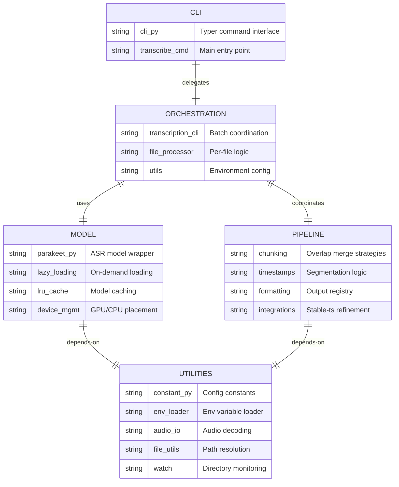
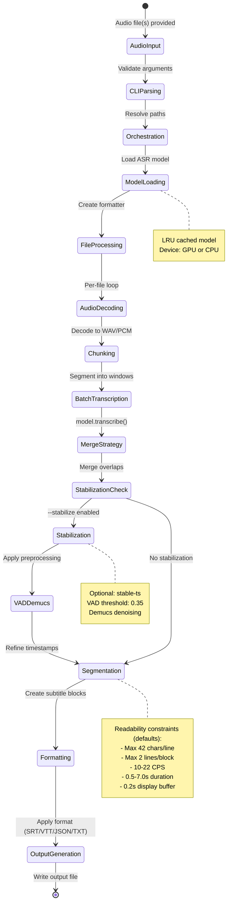

<!-- SECTIONS:ARCHITECTURE,DESIGN_PATTERNS,CLI,WEBUI,DOCKER,TESTS -->

# Project Overview – parakeet-rocm [](./VERSIONS.md)

This repository provides a containerised, GPU-accelerated Automatic Speech Recognition (ASR) inference service for the NVIDIA **Parakeet-TDT 0.6B** models (v3 by default; v2 supported), running on **AMD ROCm** GPUs.

______________________________________________________________________

## Table of Contents

- [Architecture Overview](#architecture-overview)
- [Design Patterns & Principles](#design-patterns--principles)
- [Directory layout](#directory-layout)
- [Audio / video format support](#audio--video-format-support)
- [Configuration & environment variables](#configuration--environment-variables)
- [Key technology choices](#key-technology-choices)
- [Docker](#docker)
- [Tests](#tests)
- [CLI Features](#cli-features)
- [SRT Diff Report & Scoring](#srt-diff-report--scoring)

______________________________________________________________________

## Architecture Overview

The codebase follows a **layered, modular architecture** with clear separation of concerns:

### High-Level Architecture



### Key Architectural Principles

1. **Separation of Concerns**: CLI parsing, orchestration, model management, and processing are isolated into distinct modules.
2. **Dependency Injection**: Models and formatters are passed as protocol-typed dependencies rather than hard-coded imports.
3. **Lazy Loading**: Model weights load on demand and are cached; optional integrations (stable-ts, watch mode, WebUI) are imported lazily.
4. **Single Responsibility**: Each module has a focused purpose (e.g., `merge.py` only handles chunk merging).
5. **Configuration Centralization**: All environment variables are loaded once in `utils/constant.py` and exposed as typed constants.

### Data Flow



______________________________________________________________________

______________________________________________________________________

## Design Patterns & Principles

### 1. **Protocol-Oriented Design**

**Location**: `transcription/file_processor.py`

Defines `SupportsTranscribe` and `Formatter` protocols to decouple the transcription pipeline from concrete NeMo model types:

```python
class SupportsTranscribe(Protocol):
    def transcribe(self, *, audio, batch_size, return_hypotheses, verbose) -> Sequence[Any]: ...

class Formatter(Protocol):
    def __call__(self, aligned: AlignedResult, *, highlight_words: bool = ...) -> str: ...
```

**Benefits**:

- Enables testing with mock models without GPU dependencies
- Allows swapping ASR backends without changing pipeline code
- Type-safe duck typing with static analysis support

### 2. **Registry Pattern**

**Location**: `formatting/__init__.py`

A registry maps format names to formatter metadata (function, extension, and word-timestamp
requirements):

```python
FORMATTERS: dict[str, FormatterSpec] = {
    "txt": FormatterSpec(format_func=to_txt, requires_word_timestamps=False, ...),
    "json": FormatterSpec(format_func=to_json, requires_word_timestamps=False, ...),
    "srt": FormatterSpec(format_func=to_srt, requires_word_timestamps=True, ...),
    "vtt": FormatterSpec(format_func=to_vtt, requires_word_timestamps=True, ...),
    # csv/tsv/jsonl also supported
}

def get_formatter(format_name: str) -> Callable[[AlignedResult], str]:
    spec = FORMATTERS.get(format_name.lower())
    if not spec:
        raise ValueError("Unsupported format")
    return spec.format_func
```

**Benefits**:

- Easy extension: add new formats by implementing a function and registering it
- Runtime format selection without conditional logic
- Single source of truth for supported formats

The registry pattern also applies to merge strategies:

**Location**: `chunking/merge.py`

```python
MERGE_STRATEGIES: dict[str, Callable[[list[Word], list[Word]], list[Word]]] = {
    "contiguous": merge_longest_contiguous,
    "lcs": merge_longest_common_subsequence,
}

merger = MERGE_STRATEGIES[merge_strategy]
merged_words = merger(merged_words, next_words, overlap_duration=...)
```

**Benefits**:

- Open/Closed Principle: Add new merge strategies without modifying file_processor.py
- Eliminates duplicate conditional logic
- Single source of truth for available merge strategies

### 3. **Configuration Objects (SOLID: Interface Segregation)**

**Location**: `config.py`

Configuration dataclasses group related settings to reduce parameter explosion and improve Interface Segregation compliance:

```python
from parakeet_rocm.utils.constant import DEFAULT_BATCH_SIZE, DEFAULT_CHUNK_LEN_SEC

@dataclass
class TranscriptionConfig:
    """Groups transcription-related settings."""
    batch_size: int = DEFAULT_BATCH_SIZE  # From utils/constant.py
    chunk_len_sec: int = DEFAULT_CHUNK_LEN_SEC  # From utils/constant.py
    overlap_duration: int = 15
    word_timestamps: bool = False
    merge_strategy: str = "lcs"

@dataclass
class StabilizationConfig:
    """Groups stable-ts refinement settings."""
    enabled: bool = False
    demucs: bool = False
    vad: bool = False
    vad_threshold: float = 0.35

@dataclass
class OutputConfig:
    """Groups output-related settings."""
    output_dir: Path
    output_format: str
    output_template: str
    overwrite: bool = False
    highlight_words: bool = False

@dataclass
class UIConfig:
    """Groups UI and logging settings."""
    verbose: bool = False
    quiet: bool = False
    no_progress: bool = False
```

**Usage in Pipeline**:

```python
def transcribe_file(
    audio_path: Path,
    *,
    model: SupportsTranscribe,
    formatter: Formatter,
    file_idx: int,
    transcription_config: TranscriptionConfig,
    stabilization_config: StabilizationConfig,
    output_config: OutputConfig,
    ui_config: UIConfig,
    watch_base_dirs: Sequence[Path] | None = None,
    progress: Progress | None = None,
    main_task: TaskID | None = None,
) -> Path | None:
    # Function body uses config objects
```

**Benefits**:

- **Reduced Parameter Count**: Function signatures reduced from 24 parameters to ~11 parameters
- **Logical Grouping**: Related settings are bundled together (e.g., all stabilization options in one object)
- **Interface Segregation**: Callers only need to construct config objects relevant to their concerns
- **Type Hints**: Dataclasses provide type hints and structured configuration
- **Testability**: Easy to create test fixtures with specific configurations
- **Maintainability**: Adding new settings only requires updating the relevant config class

### 4. **Singleton Configuration (Environment Variables)**

**Location**: `utils/env_loader.py`, `utils/constant.py`

Environment variables are loaded **exactly once** at module import time using `@lru_cache(maxsize=1)`:

```python
# env_loader.py
@functools.lru_cache(maxsize=1)
def load_project_env(force: bool = False) -> None:
    # Load .env file once

# constant.py
load_project_env()  # Called at import time
DEFAULT_CHUNK_LEN_SEC: Final[int] = int(os.getenv("CHUNK_LEN_SEC", "300"))
```

**Benefits**:

- Prevents accidental re-reads or inconsistent state
- Centralized configuration access via typed constants
- Enforces the "single loading point" policy (see AGENTS.md §3)

### 5. **Lazy Model Loading with LRU Cache**

**Location**: `models/parakeet.py`

The model is loaded on-demand and cached with `@lru_cache(maxsize=4)` to support multiple model variants:

```python
@lru_cache(maxsize=4)
def _get_cached_model(model_name: str) -> ASRModel:
    return _load_model(model_name)

def get_model(model_name: str) -> ASRModel:
    model = _get_cached_model(model_name)
    _ensure_device(model)  # Promote to GPU if available
    return model
```

**Benefits**:

- Defers expensive model loading until first transcription
- Supports model hot-swapping without restarting the service
- Enables idle unload to CPU for VRAM management (watch mode)

### 6. **Strategy Pattern (Merge Strategies)**

**Location**: `chunking/merge.py`

Two merge strategies are provided as pure functions:

- `merge_longest_contiguous`: Fast midpoint-based merge
- `merge_longest_common_subsequence`: Text-aware LCS merge

Selected at runtime via CLI flag `--merge-strategy` (`none`, `contiguous`, `lcs`):

```python
merger = MERGE_STRATEGIES[merge_strategy]
merged_words = merger(a, b, overlap_duration=overlap)
```

**Benefits**:

- Pluggable algorithms without modifying caller code
- Easy A/B testing and benchmarking
- Backend-agnostic (operates on `Word` models, not NeMo internals)

### 7. **Adapter Pattern**

**Location**: `timestamps/adapt.py` (inferred from usage in `file_processor.py`)

Adapts NeMo-specific hypothesis objects to the project's canonical `AlignedResult` / `Word` models:

```python
aligned_result = adapt_nemo_hypotheses(hypotheses, model, time_stride)
```

**Benefits**:

- Isolates NeMo API changes to a single adapter module
- Downstream code (segmentation, formatting) works with stable domain models
- Enables future support for non-NeMo ASR backends

### 8. **Observer Pattern (Watch Mode)**

**Location**: `utils/watch.py`

The watcher polls directories for new files and triggers a callback:

```python
def watch_and_transcribe(
    patterns: list[str],
    transcribe_fn: Callable[[list[Path]], None],
    ...
) -> None:
    while True:
        new_files = _discover_new_files(patterns, seen_files)
        if new_files:
            transcribe_fn(new_files)
        time.sleep(poll_interval)
```

**Benefits**:

- Decouples file discovery from transcription logic
- Supports idle model unloading after inactivity timeout
- Graceful shutdown via signal handlers

### 9. **Data Models (Pydantic)**

**Location**: `timestamps/models.py`

All domain models are Pydantic `BaseModel` subclasses:

```python
class Word(BaseModel):
    word: str
    start: float
    end: float
    score: float | None = None

class Segment(BaseModel):
    text: str
    words: list[Word]
    start: float
    end: float
```

**Benefits**:

- Automatic validation and type coercion
- Serialization to JSON for API/logging
- Shared schema for formatting and downstream utilities

### 10. **Dependency Inversion Principle**

High-level modules (CLI, orchestration) depend on abstractions (protocols, formatters) rather than concrete implementations:

- CLI imports `get_formatter()` (factory) not specific formatters
- File processor accepts `SupportsTranscribe` protocol, not `ASRModel`
- Merge functions operate on `Word` models, not NeMo tokens

**Benefits**:

- Testability: mock implementations satisfy protocols
- Flexibility: swap implementations without changing high-level code
- Reduced coupling between layers

### 11. **Command Pattern (CLI Structure)**

**Location**: `cli.py`

Typer commands encapsulate requests as objects with all parameters:

```python
@app.command()
def transcribe(
    audio_files: list[str] | None,
    model_name: str,
    output_dir: Path,
    # ... 20+ parameters
) -> list[Path] | None:
    # Delegate to implementation
    return _impl(...)
```

**Benefits**:

- Declarative argument definitions with type hints
- Automatic help generation and validation
- Easy to add new commands or options

______________________________________________________________________

______________________________________________________________________

## Directory layout

```txt
parakeet_rocm/
├── Dockerfile                  # Build image with ROCm dependencies
├── docker-compose.yaml         # Orchestrate container with /opt/rocm bind-mounts
├── pyproject.toml              # PDM-managed dependencies and scripts
├── README.md                   # Quick-start & usage
├── .env.example                # Example environment variables
├── data/
│   ├── samples/voice_sample.wav
│   └── watch/
├── output/                     # Default output directory (gitignored)
├── parakeet_rocm/              # Python package
│   ├── __init__.py
│   ├── __main__.py             # Entry point for `python -m parakeet_rocm`
│   ├── cli.py                  # Typer-based CLI entry point
│   ├── transcribe.py           # Thin wrapper re-exporting transcription CLI
│   ├── benchmarks/             # Runtime + GPU telemetry capture (JSON metrics)
│   ├── transcription/          # Modular transcription pipeline
│   ├── chunking/               # Chunking + overlap merge utilities
│   │   ├── chunker.py
│   │   └── merge.py
│   ├── timestamps/             # Alignment + segmentation utilities
│   │   ├── adapt.py
│   │   ├── models.py
│   │   ├── segmentation.py
│   │   └── word_timestamps.py
│   ├── formatting/             # Output formatters
│   │   ├── _csv.py
│   │   ├── _json.py
│   │   ├── _jsonl.py
│   │   ├── _srt.py
│   │   ├── _tsv.py
│   │   ├── _txt.py
│   │   └── _vtt.py
│   ├── utils/
│   │   ├── audio_io.py
│   │   ├── file_utils.py
│   │   ├── watch.py
│   │   ├── constant.py
│   │   ├── env_loader.py
│   │   └── logging_config.py
│   ├── webui/                  # Gradio WebUI
│   │   ├── app.py
│   │   ├── cli.py
│   │   └── ...
│   └── models/
│       └── parakeet.py
├── scripts/
│   ├── download_sample_audio.sh
│   ├── srt_diff_report.py
│   ├── transcribe_three.sh
│   └── transcribe_and_diff.sh
└── tests/
    ├── unit/
    ├── integration/
    ├── e2e/
    └── slow/
```

### Helper Script: transcribe_three.sh

A convenience wrapper to run three common transcription variants for a single input file:

```bash
bash scripts/transcribe_three.sh <audio_file>
```

This will generate SRT outputs in:

- `data/output/default/`
- `data/output/stabilize/` (with `--stabilize`)
- `data/output/stabilize_vad_demucs/` (with `--stabilize --vad --demucs`)

Notes:

- The script prefers `pdm run parakeet-rocm` when PDM is installed; otherwise it calls `parakeet-rocm` directly.
- Word timestamps and SRT output are enabled for all three runs.

### Unified Helper: transcribe_and_diff.sh

Run three transcription variants and then compare all pairwise SRT diffs, or run either step alone.

```bash
# Both steps (default): transcribe 3 variants then produce Markdown+JSON diffs
bash scripts/transcribe_and_diff.sh <audio_file>

# Transcribe only
bash scripts/transcribe_and_diff.sh --transcribe <audio_file>

# Report only (requires SRTs present)
bash scripts/transcribe_and_diff.sh --report <audio_file>

# Include top-N violations in reports and choose output directory
bash scripts/transcribe_and_diff.sh --report --show-violations 5 --out-dir data/test_results/ <audio_file>
```

### Outputs

- Transcriptions written to:
  - `data/output/default/`
  - `data/output/stabilize/`
  - `data/output/stabilize_vad_demucs/`
- Diff reports (Markdown and JSON) written to `data/test_results/` by default, with filenames like:
  - `srt_diff_default_vs_stabilize_<stem>.{md,json}`
  - `srt_diff_default_vs_stabilize_vad_demucs_<stem>.{md,json}`
  - `srt_diff_stabilize_vs_stabilize_vad_demucs_<stem>.{md,json}`

### Notes

- Uses `pdm run` where available. For diffing it calls `python -m scripts.srt_diff_report`, avoiding reliance on a global console entry.
- `--show-violations N` is forwarded to the diff command.

The `transcription` package isolates environment configuration, CLI
orchestration, and per-file processing. This separation of concerns keeps
the command-line interface lightweight while centralising reusable
helpers for future extensions.

## Audio / video format support

The CLI/watch pipeline accepts a curated allow-list of formats via
`utils.file_utils.AUDIO_EXTENSIONS` (audio + common video containers), while the WebUI
uses `utils.constant.SUPPORTED_EXTENSIONS` for its upload filter. Update both if you
need to accept additional formats.

Current defaults:

- CLI/watch (`AUDIO_EXTENSIONS`): `wav, mp3, aac, flac, ogg, opus, m4a, wma, aiff, alac, amr, mp4, mkv, mov, avi, webm, flv, ts`.
- WebUI (`SUPPORTED_EXTENSIONS`): `wav, mp3, flac, ogg, m4a, aac, wma, opus, mp4, mkv, avi, mov, webm, flv, wmv`.

Decoding strategy (see `utils/audio_io.py`):

1. If `FORCE_FFMPEG=1` (default), try direct FFmpeg pipe first.
2. Attempt `soundfile` (`libsndfile`).
3. Fallback to FFmpeg (if not already tried) and then **pydub + ffmpeg**.

## Configuration & environment variables

| Variable | Default | Purpose |
| -- | -- | -- |
| `DEFAULT_CHUNK_LEN_SEC` | `30` | Segment length for chunked transcription |
| `DEFAULT_BATCH_SIZE` | `1` | Batch size for inference |
| `MAX_LINE_CHARS` | `42` | Maximum characters per subtitle line |
| `MAX_LINES_PER_BLOCK` | `2` | Maximum lines per subtitle block |
| `MAX_BLOCK_CHARS` | `84` | Hard character limit per subtitle block |
| `MAX_BLOCK_CHARS_SOFT` | `90` | Soft character limit for merging segments |
| `MIN_SEGMENT_DURATION_SEC` | `0.5` | Minimum subtitle display duration |
| `MAX_SEGMENT_DURATION_SEC` | `7.0` | Maximum subtitle display duration |
| `DISPLAY_BUFFER_SEC` | `0.2` | Additional display buffer after last word |
| `BOUNDARY_CHARS` | `.?!…` | Strong punctuation boundaries |
| `CLAUSE_CHARS` | `,;:` | Clause boundaries |
| `IDLE_UNLOAD_TIMEOUT_SEC` | `300` | Idle seconds before offloading model to CPU |
| `IDLE_CLEAR_TIMEOUT_SEC` | `360` | Idle seconds before clearing model cache |
| `GRADIO_SERVER_NAME` | `0.0.0.0` | WebUI bind address |
| `GRADIO_SERVER_PORT` | `7861` | WebUI port |
| `GRADIO_ANALYTICS_ENABLED` | `False` | Toggle Gradio analytics |
| `WEBUI_PRIMARY_HUE` | `blue` | WebUI theme primary hue |
| `WEBUI_SECONDARY_HUE` | `slate` | WebUI theme secondary hue |
| `WEBUI_NEUTRAL_HUE` | `slate` | WebUI theme neutral hue |
| `BENCHMARK_OUTPUT_DIR` | `data/benchmarks` | Benchmark output directory |
| `BENCHMARK_PERSISTENCE_ENABLED` | `False` | Persist benchmarks across WebUI sessions |
| `GPU_SAMPLER_INTERVAL_SEC` | `1.0` | GPU sampling interval (seconds) |

Copy `.env.example` → `.env` and adjust as needed. ROCm runtime flags such as
`PYTORCH_HIP_ALLOC_CONF`, `HSA_OVERRIDE_GFX_VERSION`, and `NEUTRON_NUMBA_DISABLE_JIT`
are consumed directly by PyTorch/Numba (they are not exported as constants in
`utils/constant.py`).

## Key technology choices

| Area | Choice |
| -- | -- |
| GPU runtime | ROCm 6.4.2 (host bind-mount) |
| Deep-learning stack | PyTorch 2.7.1 ROCm wheels + torchaudio 2.7.1 |
| Model hub | Hugging Face `nvidia/parakeet-tdt-0.6b-v2`, `nvidia/parakeet-tdt-0.6b-v3` |
| Framework | NVIDIA NeMo 2.2 (ASR collection) |
| Package manager | PDM 2.15 – generates lockfile + requirements-all.txt |
| Container base | `python:3.10-slim` |

## Docker

Primary entry points:

- `docker-compose.yaml` (service runtime)
- `Dockerfile` (image build)

Quick start:

```bash
# Build
$ docker compose build

# Run detached (launches WebUI by default)
docker compose up -d

# Inside container
$ docker exec -it parakeet-rocm parakeet-rocm transcribe /data/samples/voice_sample.wav
```

Notes:

- The container expects ROCm userspace to be available via bind mounts (see `docker-compose.yaml`).
- `docker-compose.yaml` passes `--debug` and forwards `${GRADIO_SERVER_NAME}`/`${GRADIO_SERVER_PORT}`; the Dockerfile sets defaults for host/port.
- Most `docker-compose.yaml` environment variables are commented out by default; only `LD_LIBRARY_PATH` is set unless you uncomment overrides.

## Tests

Test suite is organized by resource requirements:

- `tests/unit/`: fast, hermetic unit tests (no markers)
- `tests/integration/`: integration tests (`pytest.mark.integration`)
- `tests/e2e/`: end-to-end tests (`pytest.mark.e2e`)
- `tests/slow/`: optionally-separated slow tests (`pytest.mark.slow`)

Marker policy:

- Prefer module-level `pytestmark` when a file is uniformly categorized.
- Use the following markers for selection:
  - `integration`
  - `e2e`
  - `gpu`
  - `slow`

CLI GPU smoke tests:

- File: `tests/integration/test_cli.py`
  - Permalink: [tests/integration/test_cli.py](https://github.com/beecave-homelab/parakeet_rocm/blob/426dbd2d753755ed18c8347984731298b8dd78ce/tests/integration/test_cli.py)
- Uses module-level markers: `integration`, `e2e`, `gpu`, `slow`.
- Uses module-level skip gates:
  - Missing sample audio: `data/samples/sample_mono.wav` (not checked in by default)
  - CI environment: `CI=true`
  - No usable GPU detected (`torch.cuda.is_available()`)

Common commands:

```bash
# All tests
pdm run pytest

# Exclude GPU/slow (CI-friendly)
pdm run pytest -m "not (gpu or slow)"

# Marker selection
pdm run pytest -m integration
pdm run pytest -m e2e
pdm run pytest -m gpu
pdm run pytest -m slow
```

## CLI Features

### Commands

- `transcribe`: Transcribe one or more audio/video files with rich progress reporting\\
- `transcribe`: Transcribe one or more audio/video files with rich progress reporting\
  ↳ `--watch <DIR|GLOB>`: continuously monitor a directory or wildcard pattern(s) for *new* media files and transcribe them automatically. The watcher:
  - polls every 2 s using `utils.watch.watch_and_transcribe()`
  - debounces already-seen files using an in-memory set
  - skips creation if an output file matching the template already exists
  - emits detailed debug lines when `--verbose` is supplied (per-scan stats, skip reasons, etc.)
- `webui`: Launch the Gradio WebUI for interactive transcription.

### Options

Inputs

- `AUDIO_FILES` (argument): One or more paths or glob patterns
- `--watch`: Watch directory/pattern for new files and transcribe automatically

Model

- `--model`: Model name/path (default: nvidia/parakeet-tdt-0.6b-v3; override via `PARAKEET_MODEL_NAME`)

Outputs

- `--output-dir`: Output directory (default: ./output)
- `--output-format`: Output format: txt, srt, vtt, json, jsonl, csv, tsv (default: txt)
- `--output-template`: Template for output filenames (`{parent}`, `{filename}`, `{index}`, `{date}`)
- `--overwrite`: Overwrite existing files

Timestamps and subtitles

- `--word-timestamps`: Enable word-level timestamps
- `--highlight-words`: Highlight words in SRT/VTT outputs

Chunking and streaming

- `--chunk-len-sec`: Segment length for chunked transcription (default: 300)
- `--overlap-duration`: Overlap between chunks (default: 15)
- `--stream`: Enable pseudo‑streaming mode (low‑latency small chunks)
- `--stream-chunk-sec`: Chunk length in seconds when `--stream` is enabled (defaults to 8 if unset)
- `--merge-strategy`: Merge overlapping chunks: `none`, `contiguous`, `lcs` (default: lcs)

Performance

- `--batch-size`: Batch size for inference (default: 12)
- `--fp16` / `--fp32`: Precision control for inference

UX and logging

- `--no-progress`: Disable the Rich progress bar
- `--quiet`: Suppress console output except progress bar
- `--verbose`: Enable verbose logging

Benchmarking

- `--benchmark`: Capture runtime metrics, GPU telemetry (AMD ROCm), and per-output quality metrics into a JSON artifact.
- `--benchmark-dir`: Override benchmark output directory (default: `data/benchmarks/`).

### WebUI (submodule)

The `parakeet_rocm.webui` submodule provides a Gradio-based UI with presets, validation, and a Benchmarks tab.

**Architecture**: The WebUI follows a clean separation of concerns:

- `__init__.py`: Export-only module exposing `build_app()` and `launch_app()` via lazy imports
- `cli.py`: Typer CLI for launching the WebUI with `--host`, `--port`, `--share`, `--debug` options
- `__main__.py`: Entry point for `python -m parakeet_rocm.webui`
- `app.py`: Gradio Blocks application factory with dependency injection

How to run:

```bash
# Via CLI subcommand
pdm run parakeet-rocm webui --host 0.0.0.0 --port 7861

# Via module entry point
pdm run python -m parakeet_rocm.webui --host 0.0.0.0 --port 7861
```

Dependencies:

- WebUI dependencies are optional (`[project.optional-dependencies].webui`). Install with:

```bash
pdm install -G webui
```

Key environment variables:

- `GRADIO_SERVER_NAME`, `GRADIO_SERVER_PORT`
- `GRADIO_ANALYTICS_ENABLED`
- `IDLE_UNLOAD_TIMEOUT_SEC`, `IDLE_CLEAR_TIMEOUT_SEC` (idle VRAM/RAM management)

Test coverage:

- `tests/unit/test_webui_*` covers lazy import wrappers, CLI entry points, job manager orchestration, and validation.

### Benchmarking (submodule)

The `parakeet_rocm.benchmarks` submodule provides runtime and GPU telemetry capture utilities.

Artifacts:

- JSON files written to `BENCHMARK_OUTPUT_DIR` (default: `data/benchmarks/`).

Telemetry provider:

- Uses `pyamdgpuinfo` when available (graceful no-op fallback when not installed).

Key environment variables:

- `BENCHMARK_OUTPUT_DIR`
- `BENCHMARK_PERSISTENCE_ENABLED` (used by WebUI job manager)
- `GPU_SAMPLER_INTERVAL_SEC`

### Verbose diagnostics

When `--verbose` is supplied, additional debug lines are emitted to aid troubleshooting and performance tuning:

- [env] Effective configuration resolved via `utils/constant.py` (loaded once from `.env`): dependency log levels and key processing constants (e.g., `NEMO_LOG_LEVEL`, `TRANSFORMERS_VERBOSITY`, `CHUNK_LEN_SEC`, `STREAM_CHUNK_SEC`, `MAX_LINE_CHARS`, `MAX_LINES_PER_BLOCK`, `MAX_SEGMENT_DURATION_SEC`, `MIN_SEGMENT_DURATION_SEC`, `MAX_CPS`, `DISPLAY_BUFFER_SEC`).
- [model] Device, dtype, and cache stats after model load.
- [plan] Total planned segments for all inputs; per-file first few chunk ranges.
- [file] Per-file stats (sample rate, duration, number of chunks, load time).
- [asr] Batch transcription timing summary (counts and wall time).
- [stable-ts] Stabilization path used and timing (with `--stabilize`, `--vad`, `--demucs`).
- [stable-ts] preparing: shows detected stable-ts/stable_whisper version and options (`demucs`, `vad`, `vad_threshold`).
- [stable-ts] verbose forwarding: when `--verbose` is active (and not `--quiet`), the app passes `verbose=True` into stable-ts so it can emit its own internal preprocessing logs (e.g., Demucs/VAD steps).
- [demucs] enabled: prints detected Demucs package version when `--demucs` is active.
- [vad] enabled: prints Silero-VAD package version and chosen threshold when `--vad` is active.
- [stable-ts] result: post-stabilization summary with `segments`, `words_pre` vs `words_post`, approximate words `changed` and percentage, plus overall `start_shift`/`end_shift` of the first/last word. Useful to verify whether stabilization (incl. VAD/Demucs) adjusted timings.
- [vad] post-stab: `words_removed=<N>` when VAD is active to indicate how many words were suppressed by VAD during stabilization.
- [stable-ts] realign defaults: when `--demucs` or `--vad` is set, stabilization enables silence-suppression realignment by default (`suppress_silence=True`, `suppress_word_ts=True`, `q_levels=10`, `k_size=3`, `min_word_dur=0.03`, `force_order=True`). This aims to make Demucs/VAD effects observable. The exact values may be tuned in future.
- [output] Final output file name, whether overwrite was used, subtitle block count, and coverage range (`start→end`).
- [timing] Overall wall-clock time for the command.

### Advanced Features

### Long Audio Processing

Automatic sliding-window chunking for long audio files. Overlapping segments are merged using one of two strategies:

- **Contiguous**: A fast, simple merge that stitches segments at the midpoint of the overlap.
- **LCS (Longest Common Subsequence)**: A more sophisticated, text-aware merge that aligns tokens in the overlap region to produce more natural transitions. This is the default and recommended strategy.

For text-only outputs (no word timestamps), the pipeline applies boundary-aware deduplication (`_dedupe_text_near_boundary`) to remove repeated phrases near chunk boundaries, followed by fuzzy overlap detection to handle minor transcription variations.

### Subtitle Readability

Intelligent segmentation that respects:

- Character limits (42 chars per line, 84 chars per block)
- Reading speed (10-22 characters per second)
- Natural clause boundaries with backtracking
- Minimum/maximum duration targets (0.5s–7.0s) and 0.2s display buffer

### File Overwrite Protection

Automatic file renaming with numbered suffixes to prevent accidental overwrites. Use `--overwrite` to force replacement.

### Stable-ts Integration

Stable-ts (the `stable_whisper` module, provided by `stable-ts-whisperless`) refines word timestamps when `--stabilize` is enabled:

- Primary path calls `stable_whisper.transcribe_any(...)` with a shim so stable-ts can run VAD/Demucs preprocessing. The audio path is passed positionally with `audio_type='str'` and `regroup=True`.
- If `transcribe_any` yields no segments and `postprocess_word_timestamps` exists, the fallback helper is used.
- If legacy helpers are missing, the code returns the original timestamps rather than erroring.

This ensures compatibility across stable-ts versions while preferring the modern API you would use for “any ASR”.

______________________________________________________________________

______________________________________________________________________

## SRT Diff Report & Scoring

The utility script `scripts/srt_diff_report.py` compares two SRT files (e.g., original vs. refined) and produces:

- A Markdown diff table with cue counts, duration stats, and CPS.
- A normalized readability score (0–100) per file plus Δ score (higher is better).
- Violation rates for key readability constraints:
  - Short/Long durations (`duration_under`, `duration_over`)
  - CPS over/under thresholds (`cps_over`, `cps_under`)
  - Line too long and too many lines per block (`line_over`, `lines_per_block_over`)
  - Block character limits – soft and hard (`block_over_soft`, `block_over_hard`; legacy `block_over` maps to hard)
  - Overlap presence and severity (`overlaps`, `overlap_severity`)
  - Gaps under display buffer (butt joins) (`gap_under_buffer`)
- A penalty breakdown table in Markdown showing per‑category weights, penalties, and contribution deltas (`duration`, `cps`, `line`, `block`, `hygiene`).
- Optional JSON output for automation and top‑N sample violations per category.
- Percentile statistics (P50/P90/P95) for cue duration and CPS, shown in Markdown and included in JSON.

### Usage of SRT Diff Report

```bash
python -m scripts.srt_diff_report \
  original.srt refined.srt \
  [--output-format <markdown|json>] [-o report.{md|json}] [--show-violations N] \
  [--weights "duration=0.35,cps=0.35,line=0.15,block=0.10,hygiene=0.05"] \
  [--fail-below-score <0..100>] [--fail-delta-below <float>]
```

### Notes on SRT Diff Report

- `srt-diff-report` is a development-only PDM script and is not installed as a console command. Use `pdm run srt-diff-report` (dev script) or `python -m scripts.srt_diff_report`.
- Thresholds (e.g., `MIN_SEGMENT_DURATION_SEC`, `MAX_SEGMENT_DURATION_SEC`, `MIN_CPS`, `MAX_CPS`, `MAX_LINE_CHARS`, `MAX_LINES_PER_BLOCK`, `MAX_BLOCK_CHARS`, `MAX_BLOCK_CHARS_SOFT`, `DISPLAY_BUFFER_SEC`) are imported from `parakeet_rocm.utils.constant`, ensuring alignment with environment configuration and the environment‑variables policy.
- JSON schema v1.1:
  - `schema_version`: "1.1"
  - `generated_at`: ISO‑8601 timestamp
  - `inputs`: paths of `original` and `refined`
  - `env`: effective thresholds (same as shown in Markdown "Environment (Thresholds)")
  - `original` / `refined`: `score` plus `counts`, `rates`, `aggregates`, `percentiles`, and `per_cue` details
  - `delta`: `score` and cue count delta
  - `score_breakdown`: `{ weights, original, refined }` where each category exposes `{ weight, penalty, contribution }`
  - `violations` (optional; set when `--show-violations N` > 0): top‑N per‑category lists for both `original` and `refined`, each with `{index, factor, detail}`
- Reports always include the effective environment thresholds in both Markdown and JSON outputs (section/table "Environment (Thresholds)"; JSON key `env`).
- `--show-violations N` also adds two Markdown tables with the top‑N worst per‑category cues for Original and Refined.
- Use `--output-format json` to emit JSON (to stdout or to `-o <file>.json`). Use `--output-format markdown` (default) for Markdown. The `-o/--output` accepts either `.md` or `.json`.

### Weights and CI/Automation

- Custom weights: supply `--weights` with comma‑separated `key=value`. Allowed keys are `duration,cps,line,block,hygiene`. Values are normalized to sum to 1.0. These weights affect both the Markdown breakdown and the computed scores in JSON.
- Exit codes for CI: use `--fail-below-score <threshold>` to fail if the refined score is below the threshold (0..100). Use `--fail-delta-below <delta>` to fail if `(refined − original)` score delta is below the given value. Either can be used alone or together.

### Examples of using SRT Diff Report

```bash
# Emit JSON and fail pipeline if refined score < 85
python -m scripts.srt_diff_report orig.srt ref.srt --output-format json --fail-below-score 85

# Favor duration in the score and require at least +0.5 improvement
python -m scripts.srt_diff_report orig.srt ref.srt --output-format json \
  --weights "duration=0.7,cps=0.2,line=0.05,block=0.03,hygiene=0.02" \
  --fail-delta-below 0.5
```

______________________________________________________________________

______________________________________________________________________

**Always update this file when code or configuration changes.**
